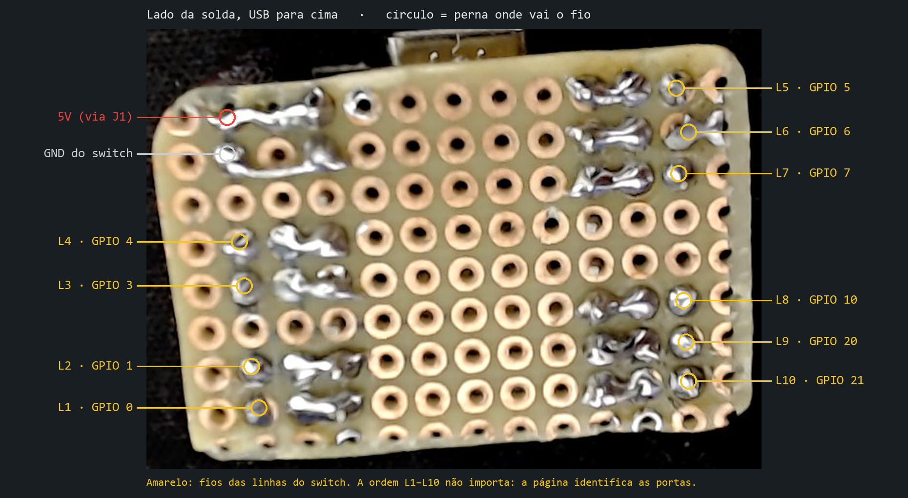
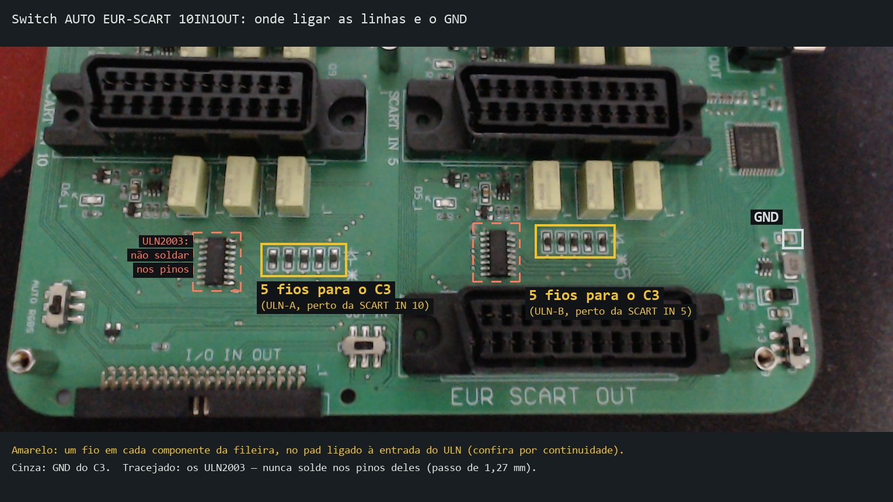
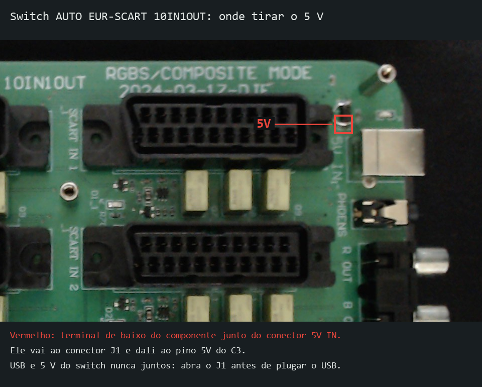
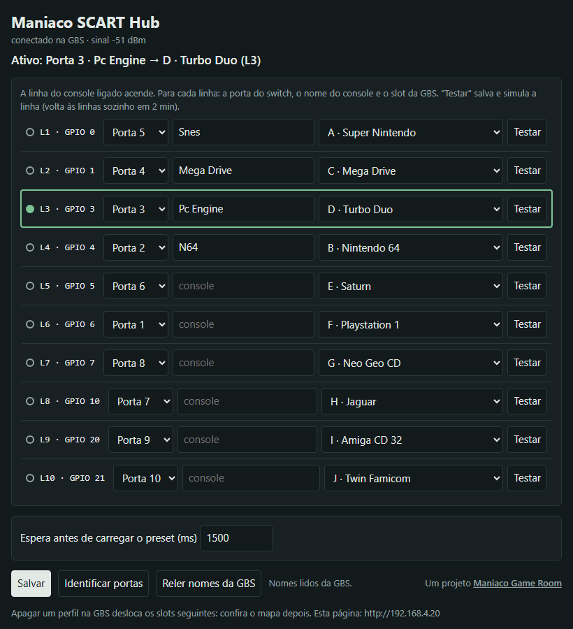

# Maniaco SCART Hub Manual

**[Versão em português](MANUAL.md)**

Maniaco SCART Hub makes the **GBS-Control** load the profile of the console selected by your **automatic SCART switch** on its own. An ESP32-C3 SuperMini installed inside the switch reads which port is active and tells the GBS over the GBS's own Wi-Fi. This manual covers the measurements, the assembly, flashing the firmware and the configuration page.

A **[Maniaco Game Room](https://www.maniacogameroom.com.br/)** project.

> The configuration page is in Portuguese. Its labels are shown here in **Portuguese (English)**.

---

## Contents

1. [Before you start](#1-before-you-start)
2. [Measuring the switch](#2-measuring-the-switch)
3. [Building the board](#3-building-the-board)
4. [Wiring it to the switch](#4-wiring-it-to-the-switch)
5. [Flashing the firmware](#5-flashing-the-firmware)
6. [First setup](#6-first-setup)
7. [The configuration page](#7-the-configuration-page)
8. [ESP32-C3 LED](#8-esp32-c3-led)
9. [Power: USB and 5 V](#9-power-usb-and-5-v)
10. [Updating the firmware](#10-updating-the-firmware)
11. [Troubleshooting](#11-troubleshooting)
12. [Credits](#12-credits)

---

## 1. Before you start

**You need:**

- an **ESP32-C3 SuperMini**;
- a **10-port automatic SCART switch** with 2× ULN2003 driving the relays;
- a **GBS-Control**, using its own network (`gbscontrol`);
- 10× **10 kΩ** resistors (1/4 W), a **470 µF / 10 V** electrolytic capacitor, a **2-pin connector** (male/female header), a small perfboard (~12 × 9 holes) and thin wire (26 to 30 AWG);
- a multimeter, a fine-tip soldering iron and a USB-C data cable.

**Firmware:** download it from the [Releases](../../releases) page. Each version has two files:

| File | When to use |
|---|---|
| `maniaco-scart-hub-X.Y.Z-instalacao.bin` | First flash (erases the saved map) |
| `maniaco-scart-hub-X.Y.Z-atualizacao.bin` | Update (keeps the saved map) |

Check the files against the `SHA256SUMS.txt` in the same release: `Get-FileHash file.bin` in PowerShell, or `sha256sum file.bin` on Linux/Mac. The hash must match; if it doesn't, don't flash it.

> **Do the whole installation with the switch unplugged.** You do it at your own risk.

---

## 2. Measuring the switch

Multimeter only, **before soldering anything**.

> ⚠️ **Do not touch the ULN2003 pins with the probe.** The pitch is 1.27 mm: a slipping probe causes a short. Measure on the **pads of the resistors** connected to them.

**With the switch unplugged, find the points:**

1. Locate the two **ULN2003** (16-pin chips near the relays). Pin 1 is on the side of the dot on the chip; pins 1 to 7 are the inputs.
2. Follow the trace of each input to the **SMD resistor** connected to it (usually marked "472").
3. In continuity mode, find which **pad** of that resistor reads **0 Ω to the ULN pin**: that is the ULN-side pad, where you will solder.
4. Find the switch's **5 V converter output capacitor** (near the DC input): its + and − will be your 5 V and GND.

**With the switch on and one console on** (wait for the relay click), black probe on the capacitor's −, multimeter on DC:

| Where | Expected |
|---|---|
| + of the converter capacitor | ~4.5 to 5 V |
| Resistor pad of the active port (ULN side) | ~3.3 to 3.8 V |
| Pads of the other ports | ~0 V |

Repeat for every port. What to do with the result:

| If you measured... | Then |
|---|---|
| ~3.3 to 3.8 V on the active port, ~0 V on the others | Follow this manual as is (10 kΩ resistor only) |
| ~5 V on the active port | Add an **18 kΩ** resistor from the GPIO to GND on each line (divider), on top of the 10 kΩ |
| Active port **low** and the others high, or a fluctuating voltage | **This firmware won't work** with your switch. Don't connect it |
| More than one pad high with a single console | Unsupported switch. Don't connect it |

---

## 3. Building the board

> **Hole-by-hole drawing:** the [interactive assembly page](https://www.maniacogameroom.com.br/montagem/maniaco-scart-hub/) (in Portuguese) shows the 12 × 9 hole board from the top and from below. There is also an [assembly tutorial](https://www.maniacogameroom.com.br/2026/10/maniaco-scart-hub-montagem-da-placa) on the blog (in Portuguese).

1. **Solder the ESP32-C3 to the perfboard** with male pin headers, with the **USB-C at the board edge** (so you can plug in the cable after installation).
2. **10 kΩ resistors standing up**, one next to each GPIO used: body in the outer hole, bent leg in the hole next to the pin. On the solder side, bridge the pin to that leg. Put thin heat-shrink on the bent legs if they end up close to each other.
3. **GPIOs used** (order doesn't matter, the page identifies them later):

   | Line | L1 | L2 | L3 | L4 | L5 | L6 | L7 | L8 | L9 | L10 |
   |---|---|---|---|---|---|---|---|---|---|---|
   | GPIO | 0 | 1 | 3 | 4 | 5 | 6 | 7 | 10 | 20 | 21 |

   **Don't use** GPIO 2, 8 and 9: 2 and 9 set the boot mode, and 8 is the LED. The 3.3, 2, 8 and 9 pins connect to nothing.
4. **470 µF capacitor** in the corner of the 5V and G pins: **+** leg to 5V, **−** leg (the striped one) to G.
5. **Check with the multimeter** before connecting anything:

| Probes on | Should read |
|---|---|
| GPIO pin and the outer leg of its resistor | ~10 kΩ |
| Outer legs of two neighbouring resistors | Never zero |
| 5V and G | Rises slowly (capacitor charging), never zero |



---

## 4. Wiring it to the switch

Switch **unplugged**. 5 V goes last.

The photos below are from an **AUTO EUR-SCART 10IN1OUT** switch (board 2024-03-17-DJF), with labels in Portuguese. On another model, use the points you found in section 2.





1. **GND:** wire from the ESP32-C3 **G** pin to the converter capacitor **−**, or a wide GND pad. Never to ULN pin 8.
2. **Lines:** one wire from the outer leg of each resistor to the **ULN-side resistor pad** of one port (section 2). Route the GPIO 20 and 21 wires away from the ESP32-C3 antenna.
3. **5 V:** wire from the converter capacitor **+** to the **2-pin connector**, and from the connector to the **5V** pin. **Leave the connector open** until the end of section 6.
4. Label the connector: **"5V: disconnect before USB"**.
5. With the multimeter, check each new solder joint against its neighbours: never zero.

---

## 5. Flashing the firmware

> ⚠️ **5 V connector open** for the whole flashing process ([why](#9-power-usb-and-5-v)).

**From the browser (easiest):** open the [Maniaco SCART Hub installer](https://www.maniacogameroom.com.br/instalar/maniaco-scart-hub/) in **Chrome** or **Edge** on a computer, plug the ESP32-C3 into USB, click **Instalar** (Install), pick the port and, on a first install, accept **erasing** the device.

**With `esptool`:**

```bash
esptool --chip esp32c3 write-flash 0x0 maniaco-scart-hub-X.Y.Z-instalacao.bin
```

**After flashing, unplug and replug the USB** (the ESP32-C3 stays in download mode until you do).

> Flashing won't start? Hold **BOOT**, press and release **RST**, release **BOOT** and try again.

---

## 6. First setup

1. **Check the GBS network:** power on the GBS. The `gbscontrol` network should show up within a few seconds. If the GBS is connected to your home network, `gbscontrol` won't appear: use **Reset → Reset WiFi** in the GBS OLED menu.
2. With the ESP32-C3 still on USB, **power on the switch**. This is fine because the 5 V connector is open.
3. On your phone, join the **`gbscontrol`** network and open **`http://192.168.4.20`**. Bookmark it: the address never changes.
4. Click **Identificar portas** (Identify ports) and follow the steps (section 7.2). Every port with a console must light up a line; if one doesn't, check its solder joint.
5. On each line, pick the **GBS profile**, name the console and click **Salvar** (Save).
6. Use **Testar** (Test) on each line to check the profile on the TV.

**Switch to the switch's power supply:**

1. **Unplug the USB cable first.**
2. Close the 5 V connector and power on the switch. Within ~30 s the ESP32-C3 joins the GBS and the page opens again.
3. Close the case and check the **signal** at the top of the page. If it's very weak (below −75 dBm), move the board away from metal parts.

---

## 7. The configuration page



### 7.1 The screen

| Part | What it shows |
|---|---|
| **Top** | The connection to the GBS (with signal strength) and the **Ativo** (Active) line, e.g. "Ativo: Porta 3 · Pc Engine → D · Turbo Duo (L3)" |
| **Lines L1 to L10** | One per wire connected to the switch: switch **Porta** (Port), **console name**, GBS **profile** and **Testar** (Test). The line of the console that is on lights up |
| **Espera antes de carregar o preset** (Wait before loading the preset) | Fine-tuning of the switching time (section 7.4) |
| **Buttons** | **Salvar** (Save), **Identificar portas** (Identify ports) and **Reler nomes da GBS** (Reload GBS names) |
| **Footer** | The firmware version |

- **Porta (Port):** only identifies which switch port that line is. The same port can't be on two lines.
- **Profile:** the GBS slot loaded when the line becomes active. The list shows the names saved on the GBS: named profiles first, then empty slots.
- **Não trocar o perfil (Don't change the profile):** when that port becomes active, nothing is sent to the GBS. Use it for consoles without their own profile or unused ports.
- After changing anything, click **Salvar** (Save). The map is stored on the ESP32-C3.

### 7.2 Identify ports

1. Click **Identificar portas**. The page asks: "Porta 1 de 10: ligue só o console da porta 1 do switch" (Port 1 of 10: turn on only the console on switch port 1).
2. Turn that console on. When its line lights up and stays stable, "Detectado: L6" (Detected: L6) appears. Click **Confirmar** (Confirm).
3. No console on that port? Click **Pular esta porta** (Skip this port).
4. At the end, click **Salvar e concluir** (Save and finish).

**Cancelar** (Cancel) restores the ports as they were. If the same line shows up for two ports, the wizard warns you and won't let you confirm. Meanwhile, the GBS keeps receiving each line's profile: it's normal for the picture to change.

### 7.3 Test

Saves the map and makes the GBS load that line's profile right away. A yellow "Simulando a linha…" (Simulating line…) notice appears: during this time the switch is ignored. Click **Voltar às linhas** (Back to the lines) when done; if you forget, it goes back on its own after 2 minutes.

### 7.4 Wait before loading the preset

When the port changes, the ESP32-C3 selects the profile on the GBS immediately and, after this wait, tells it to load it. The wait gives the new console time to stabilise its signal: loading without a signal makes the GBS fall back to a default preset (480p).

- **Default:** 1500 ms.
- **The profile changes but the picture is wrong?** Increase it, e.g. to 2500 ms.
- **0:** never sends the load command. Only useful if your GBS always reloads on its own.

### 7.5 When it sends

- **The port changed:** selects the profile right away and loads it after the wait. If the port changes again before that, the newest one wins.
- **No console, or "Don't change the profile":** sends nothing.
- **The GBS rebooted or Wi-Fi dropped:** on reconnecting, it resends the current port's profile.
- **Otherwise, nothing.** Every change is written to the GBS's memory, so there are no repeated sends.

---

## 8. ESP32-C3 LED

| LED | Meaning |
|---|---|
| Slow blink (once per second) | Looking for the GBS network |
| Fast blink | The GBS didn't answer; retrying |
| Medium blink | More than one line active, or unstable signal on the lines |
| On | Connected, with an active port |
| Off | Connected, no active port |

---

## 9. Power: USB and 5 V

> **Rule:** with the switch's 5 V wire connected to the ESP32-C3 5V pin, **don't plug in the USB cable** (PC, charger or power bank). To use USB, **open the 5 V connector first**.

**Why:** on the ESP32-C3 SuperMini, the 5V pin is the USB VBUS itself, with no protection in between. With both connected:

- **the PC starts powering the switch** through its USB port (USB sits at ~5.0 V, above the switch rail), and the port may shut down or be damaged;
- **with the PC off, the switch powers the PC** through the cable;
- **the two supplies fight** over the same wire;
- **the PC ground gets tied to the switch, GBS and TV grounds**, which can add noise to the picture.

**To use USB with everything installed:** open the 5 V connector (GND can stay), plug in USB, and the switch can stay on. When done, **unplug USB first** and only then close the connector.

| Situation | Allowed? |
|---|---|
| 5 V connector closed, no USB (normal use) | **Yes** |
| USB plugged in, 5 V connector open (flashing, debugging) | **Yes** |
| USB plugged in **and** 5 V connector closed | **No** |

---

## 10. Updating the firmware

1. **Open the 5 V connector.** Then plug in USB.
2. Flash the **update** file, which keeps the map:
   - **from the browser:** answer **no** when the installer asks whether to erase;
   - **with `esptool`:**
     ```bash
     esptool --chip esp32c3 write-flash 0x10000 maniaco-scart-hub-X.Y.Z-atualizacao.bin
     ```
3. Unplug USB and **only then** close the 5 V connector.
4. Check the version in the page footer.

To **go back to a previous version**, flash its update file the same way.

---

## 11. Troubleshooting

| Problem | What to do |
|---|---|
| The ESP32-C3 port doesn't show up on the computer | Try another cable (it must be a data cable). Hold BOOT, press and release RST, release BOOT |
| Flashed, but nothing happens | Unplug and replug USB: after flashing, the ESP32-C3 stays in download mode |
| `192.168.4.20` won't open | Is the phone on the `gbscontrol` network (not your home one)? Is the switch on? Wait ~30 s after powering on the GBS |
| The `gbscontrol` network drops now and then | The GBS has your home network saved: **Reset → Reset WiFi** in the GBS OLED menu |
| The profile list shows only letters | The GBS was low on free memory. Click **Reler nomes da GBS** (Reload GBS names) |
| A port doesn't light up in Identify ports | That port's wire solder joint, or the wrong resistor pad. Measure again (section 2) |
| Two lines light up together | Solder bridge between neighbouring wires. Unplug and check with the multimeter |
| The profile changes but the picture isn't right | Increase **Espera antes de carregar o preset** (section 7.4) |
| I deleted a profile on the GBS and ports now load the wrong one | Deleting a profile shifts the following ones. Pick each line's profile again |
| The ESP32-C3 reboots when a console turns on | The switch supply is at its limit: a larger capacitor (1000 µF) next to the ESP32-C3, or a better switch power supply |

---

## 12. Credits

- gbs-control: **[ramapcsx2/gbs-control](https://github.com/ramapcsx2/gbs-control)** and contributors
- GBS-Control PT-BR: **[Maniaco Game Room](https://github.com/maniaco007/Projeto-GBSC---BR-by-Maniaco)**
- Arduino core for ESP32 and ESP-IDF: **[Espressif](https://github.com/espressif/arduino-esp32)**
- In-browser installer: [ESP Web Tools](https://esphome.github.io/esp-web-tools/)

License: **Freeware — free to use. © 2026 Maniaco Game Room. All rights reserved.** See the [license](LICENCA.md) and the [third-party components](TERCEIROS.md).
