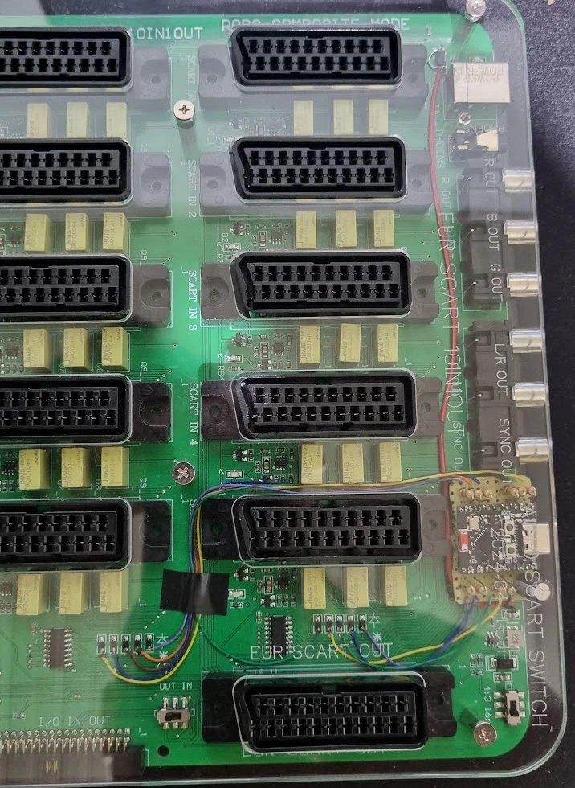
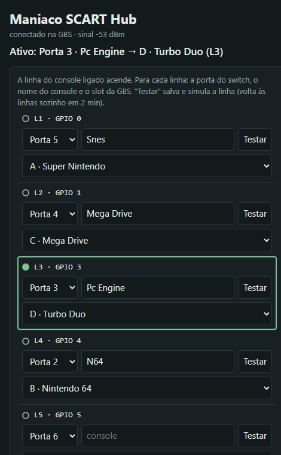

# Maniaco SCART Hub

**[Português](README.md)**

**Automatic GBS-Control profile switching based on the console selected by your SCART switch: turn the console on and the picture is already right, with no cable between the switch and the GBS and no changes to the GBS firmware.**

A **[Maniaco Game Room](https://www.maniacogameroom.com.br/)** project.

## What Maniaco SCART Hub brings

| | |
|---|---|
|  |  |

- **Automatic profile switching:** an ESP32-C3 SuperMini inside the switch reads which port is active and, over the GBS's own Wi-Fi, makes it load that console's profile in about 1.5 s.
- **Follows the switch's own decision:** the switch stays on the last console turned on and goes back to the previous one when it turns off. Maniaco SCART Hub just follows along.
- **Configuration page** on your phone or PC (`http://192.168.4.20`), nothing to install:
  - **live active port**: the line of the console that is on lights up;
  - **Identify ports**: a wizard that finds which wire is which port, one console at a time;
  - **profiles by name**, as saved on the GBS itself;
  - **Test**, to check each profile on the TV;
  - **Don't change the profile**, for consoles without their own profile.
- **Nothing changes on the GBS:** it uses the same commands as the gbs-control web interface.
- **The map is stored** on the ESP32-C3 and survives power-off and firmware updates.

> The configuration page and the manual's screenshots are in Portuguese.

## How to use

1. Download the firmware from the **[Releases](../../releases)** page.
2. Measure your switch, build the board with the ESP32-C3 and the resistors, and wire it to the switch (5 V last).
3. Flash the firmware over USB, **with the switch's 5 V wire disconnected**: with the [in-browser installer](https://www.maniacogameroom.com.br/instalar/maniaco-scart-hub/) (Chrome or Edge on a computer) or with `esptool`.
4. On your phone, join the GBS's `gbscontrol` network, open `http://192.168.4.20`, click **Identificar portas** (Identify ports) and pick each console's profile.

Full step-by-step, with measurements, assembly and every option: **[Manual](MANUAL.en.md)**.

## Requirements

- **ESP32-C3 SuperMini.**
- **10-port automatic SCART switch** with 2× ULN2003 driving the relays. Tested on a model whose port select lines are active high (~3.7 V). Switches with different electronics must be measured first (the manual shows how).
- **GBS-Control**, using its own network (`gbscontrol`, default password). Tested with [GBS-Control PT-BR](https://github.com/maniaco007/Projeto-GBSC---BR-by-Maniaco) v1.0.4.
- 10× 10 kΩ resistors, a 470 µF / 10 V capacitor, a 2-pin connector, a small perfboard and thin wire.
- To flash: Chrome or Edge on a computer (in-browser installer) or `esptool`; a USB-C data cable.

## Warning

- **Never connect USB and the switch's 5 V at the same time.** On the ESP32-C3 SuperMini, the 5V pin is the USB VBUS itself. To use the USB cable with the board installed, disconnect the 5 V wire first. See [Power: USB and 5 V](MANUAL.en.md#9-power-usb-and-5-v).
- **Do not solder to the ULN2003 pins** (1.27 mm pitch): the lines are taken from the pads of the resistors connected to them, and 5 V and GND from the switch's power input.
- Installation means soldering inside a mains-powered device connected to other equipment. **Do it at your own risk**, always with the switch unplugged.
- Maniaco SCART Hub is **not affiliated** with the gbs-control project or with the makers of the GBS-Control, the ESP32-C3 or the switch.

## Credits

- gbs-control: **[ramapcsx2/gbs-control](https://github.com/ramapcsx2/gbs-control)** and contributors
- GBS-Control PT-BR: **[Maniaco Game Room](https://github.com/maniaco007/Projeto-GBSC---BR-by-Maniaco)**
- Arduino core for ESP32 and ESP-IDF: **[Espressif](https://github.com/espressif/arduino-esp32)**
- In-browser installer: [ESP Web Tools](https://esphome.github.io/esp-web-tools/)

## License

**Freeware — free to use. © 2026 Maniaco Game Room. All rights reserved.** See the [license](LICENCA.md) and the [third-party components](TERCEIROS.md).

Found a problem? Open an [Issue](../../issues).
