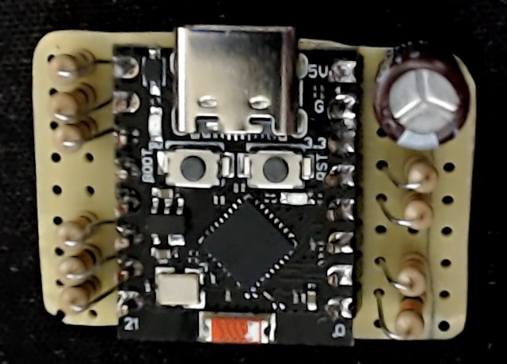

**[English](README.en.md)**

**Troca automática do perfil da GBS-Control conforme o console escolhido no switch SCART: liga o console e a imagem já vem certa, sem cabo entre o switch e a GBS e sem mexer no firmware da GBS.**

Um projeto do blog **[Maniaco Game Room](https://www.maniacogameroom.com.br/)**.

## O que o Maniaco SCART Hub traz

| | |
|---|---|
|  |  |

- **Troca automática de perfil:** um ESP32-C3 SuperMini dentro do switch lê qual porta está ativa e, pelo Wi-Fi da própria GBS, faz ela carregar o perfil daquele console em cerca de 1,5 s.
- **Lê a decisão do próprio switch:** o switch fica no último console ligado e volta ao anterior quando esse desliga. O Maniaco SCART Hub só acompanha.
- **Página de configuração** no celular ou no PC (`http://192.168.4.20`), sem instalar nada:
  - **porta ativa ao vivo**: a linha do console ligado acende;
  - **Identificar portas**: assistente que descobre qual fio é qual porta, um console por vez;
  - **perfis pelo nome** salvo na própria GBS;
  - **Testar**, para conferir cada perfil na TV;
  - **Não trocar o perfil**, para consoles sem perfil próprio.
- **Nada muda na GBS:** usa os mesmos comandos que a interface web do gbs-control.
- **O mapa fica gravado** no ESP32-C3 e sobrevive a desligar e a atualizar o firmware.

## Como usar

1. Baixe o firmware na página de **[Releases](../../releases)**.
2. Meça o seu switch, monte a placa com o ESP32-C3 e os resistores e ligue no switch (o 5 V por último).
3. Grave o firmware pelo USB, **com o fio de 5 V do switch desconectado**: pelo [instalador no navegador](https://www.maniacogameroom.com.br/instalar/maniaco-scart-hub/) (Chrome ou Edge no computador) ou pelo `esptool`.
4. No celular, entre na rede `gbscontrol` da GBS, abra `http://192.168.4.20`, clique em **Identificar portas** e escolha o perfil de cada console.

Passo a passo completo, com as medições, a montagem e todas as opções: **[Manual](MANUAL.md)**.

## Requisitos

- **ESP32-C3 SuperMini.**
- **Switch SCART automático de 10 portas** com 2× ULN2003 acionando os relés. Testado num modelo com as linhas de seleção ativas em nível alto (~3,7 V). Switches com outra eletrônica precisam ser medidos antes (o manual mostra como).
- **GBS-Control**, usando a rede própria (`gbscontrol`, senha padrão). Testado com o [GBS-Control PT-BR](https://github.com/maniaco007/Projeto-GBSC---BR-by-Maniaco) v1.0.4.
- 10 resistores de 10 kΩ, capacitor de 470 µF / 10 V, conector de 2 pinos, placa perfurada pequena e fio fino.
- Para gravar: Chrome ou Edge num computador (instalador pelo navegador), ou o `esptool`; cabo USB-C de dados.

## Aviso

- **USB e 5 V do switch nunca juntos.** No ESP32-C3 SuperMini, o pino 5V é o próprio VBUS do USB. Para usar o cabo USB com a placa instalada, desconecte antes o fio de 5 V. Veja [Alimentação: USB e 5 V](MANUAL.md#9-alimentação-usb-e-5-v).
- **Não solde nos pinos dos ULN2003** (passo de 1,27 mm): as linhas saem dos pads dos resistores ligados a eles, e o 5 V e o GND do capacitor de saída do conversor do switch.
- A montagem envolve solda dentro de um aparelho ligado à tomada e a outros equipamentos. **Faça por sua conta e risco**, sempre com o switch desligado.
- O Maniaco SCART Hub **não é afiliado** ao projeto gbs-control nem aos fabricantes da GBS-Control, do ESP32-C3 ou do switch.

## Créditos

- gbs-control: **[ramapcsx2/gbs-control](https://github.com/ramapcsx2/gbs-control)** e colaboradores
- GBS-Control PT-BR: **[Maniaco Game Room](https://github.com/maniaco007/Projeto-GBSC---BR-by-Maniaco)**
- Arduino core para ESP32 e ESP-IDF: **[Espressif](https://github.com/espressif/arduino-esp32)**
- Instalador pelo navegador: [ESP Web Tools](https://esphome.github.io/esp-web-tools/)

## Licença

**Freeware — uso gratuito. © 2026 Maniaco Game Room. Todos os direitos reservados.** Veja a [licença](LICENCA.md) e os [componentes de terceiros](TERCEIROS.md).

Encontrou um problema? Abra uma [Issue](../../issues).
